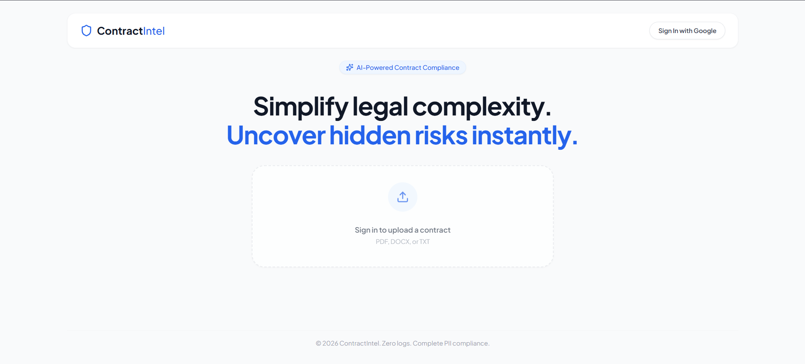
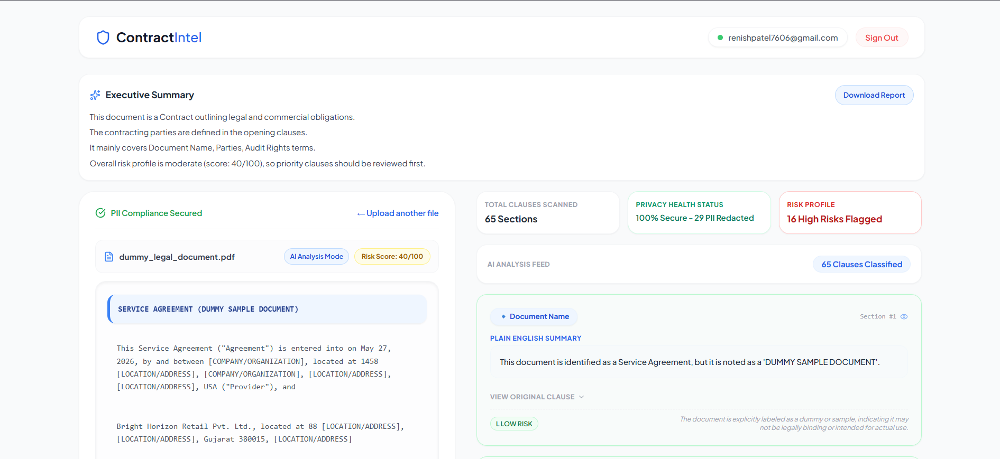
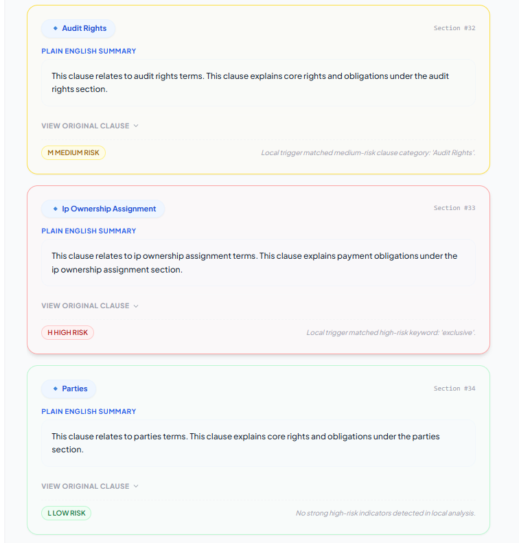
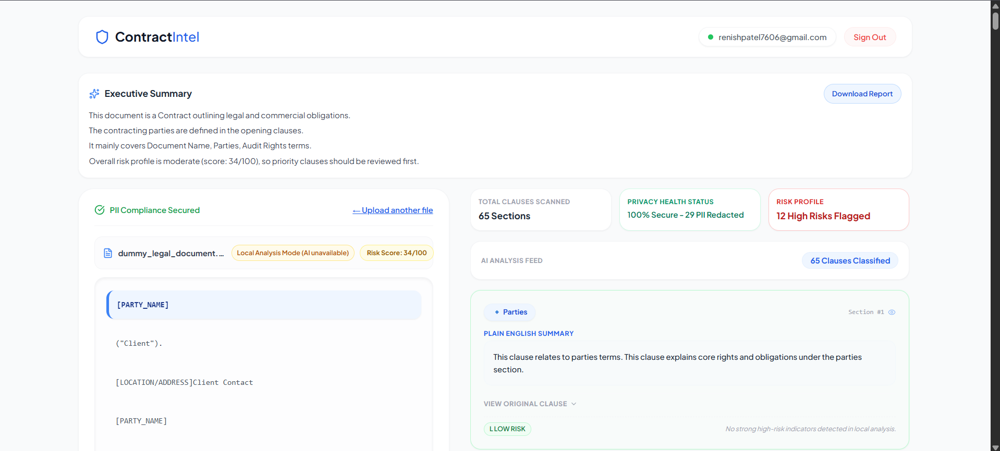
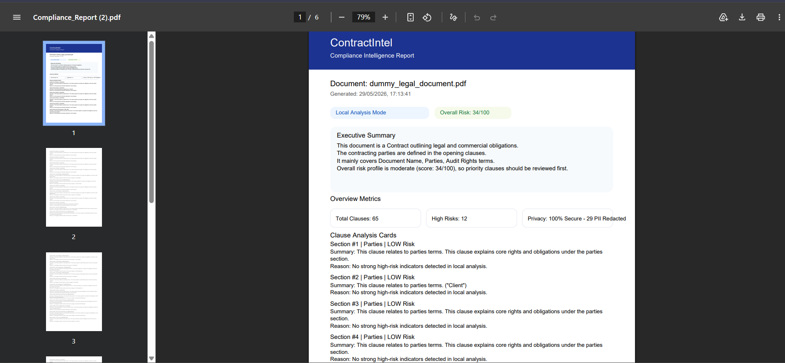

<div align="center">

# ContractIntel

**AI-Powered Contract Compliance Intelligence**

*Simplify legal complexity. Uncover hidden risks instantly.*

[](https://djangoproject.com)
[](https://react.dev)
[](https://postgresql.org)
[](https://ai.google.dev)
[](https://tailwindcss.com)
[](LICENSE)

</div>

---

## What is ContractIntel?

ContractIntel is a full-stack AI contract analysis platform that automatically reads legal documents, scrubs personal information before it reaches any server, classifies every clause using a locally-trained machine learning model, and generates plain-English summaries and risk scores — all in a single workflow. The goal is to make legal contracts comprehensible to anyone, not just lawyers.

Upload a contract. Get a risk-scored, plain-English breakdown. Download a compliance report. Your raw document text never leaves your machine unprotected.

---

## Screenshots

### Landing Page
Clean, minimal entry point. Google OAuth sign-in. Drag-and-drop contract upload.



### Analysis Dashboard — AI Mode
Split-screen interface. Left panel: PII-scrubbed document with live clause highlighting. Right panel: AI-generated analysis feed with colour-coded risk cards.



### Risk-Scored Clause Cards
Each clause card shows its ML-predicted category, a plain-English summary from Gemini, and a risk level (LOW / MEDIUM / HIGH) with an explanation.



### Local Analysis Mode
When the Gemini API is unavailable, ContractIntel falls back to a fully local keyword and category-based risk engine — no external dependencies required.



### PDF Compliance Report
One-click export of the full analysis — risk scores, clause summaries, executive overview — as a branded PDF.



---

## Core Features

**Privacy-First Architecture**
Before any text is stored in the database, a spaCy NER pipeline and regex engine strip all personally identifiable information: names become `[PARTY_NAME]`, organisations become `[COMPANY/ORGANIZATION]`, addresses become `[LOCATION/ADDRESS]`. Only the scrubbed text is ever persisted.

**Local ML Clause Classifier**
A LinearSVC model trained on the CUAD (Contract Understanding Atticus Dataset) categorises every paragraph into legal clause types — Indemnification, Governing Law, IP Ownership Assignment, Termination for Convenience, and 40+ others — entirely on-device with no network call required.

**Batched AI Summarisation & Risk Scoring**
A single Gemini API call processes the entire document at once, returning plain-English summaries and LOW / MEDIUM / HIGH risk assessments with explanations for every clause simultaneously. No per-paragraph API calls, no quota exhaustion.

**Local Risk Fallback Engine**
When Gemini is unavailable or quota is exhausted, a deterministic keyword-matching and clause-category baseline engine assigns risk levels locally. The UI clearly indicates which mode is active.

**Risk Scoring**
An overall document risk score (0–100) is calculated from the weighted distribution of clause risk levels and displayed prominently. Individual clause cards are colour-coded: green borders for low risk, yellow for medium, red for high.

**Executive Summary**
A four-sentence natural-language summary of the document — document type, contracting parties, main clause categories, and overall risk profile — is generated automatically and shown above the workspace.

**Sync-Scroll Split Screen**
Clicking a clause card in the right panel highlights and scrolls to the corresponding paragraph in the left panel. Clicking a paragraph in the left panel scrolls the right panel to its analysis card. Both directions are fully bidirectional.

**PDF Compliance Report**
A branded, multi-page PDF report is generated client-side with jsPDF. It includes the executive summary, overview metrics, and a full section-by-section breakdown of every classified clause.

**Google OAuth**
Authentication is handled entirely via Google Sign-In. No passwords stored. JWT tokens are issued by the Django backend for subsequent API calls.

---

## Architecture

```
┌──────────────────────────────────────────────────────────────┐
│                        Frontend (React 19 + Vite)            │
│                                                              │
│   Google OAuth ──► JWT Storage ──► Axios API Client          │
│                                                              │
│   Upload Page ──► Split-Screen Dashboard ──► PDF Export      │
│                         │                                    │
│              Bidirectional clause sync                        │
└──────────────────────────────┬───────────────────────────────┘
                               │ HTTPS (JWT Bearer)
┌──────────────────────────────▼───────────────────────────────┐
│                    Backend (Django 5.2 + DRF)                │
│                                                              │
│  File Upload ──► Text Extraction (pypdf / python-docx)       │
│       │                                                      │
│       ▼                                                      │
│  PII Scrubber (spaCy en_core_web_sm + regex)                 │
│       │                                                      │
│       ▼                                                      │
│  Paragraph Splitter                                          │
│       │                                                      │
│       ├──► Local ML Classifier (LinearSVC / CUAD)            │
│       │         Predicts clause category per paragraph        │
│       │                                                      │
│       └──► Gemini Batch Call (ONE call for all clauses)      │
│                 Returns: simplified_text + risk_level         │
│                 Fallback: local keyword engine                │
│                                                              │
│  ContractClause.bulk_create() ──► PostgreSQL                 │
│       │                                                      │
│       └──► Overall risk score calculated ──► Document.save() │
└──────────────────────────────────────────────────────────────┘
                               │
                    ┌──────────▼──────────┐
                    │     PostgreSQL       │
                    │  Documents          │
                    │  ContractClauses    │
                    └─────────────────────┘
```

**Key architectural decisions:**

The ML classifier and PII scrubber run entirely locally — they have no internet dependency and add zero latency from network round-trips. The Gemini call is deliberately batched: one API request regardless of document length, avoiding the per-paragraph call pattern that exhausts free-tier quotas in seconds. If Gemini is unreachable, the system degrades gracefully to local analysis with clearly communicated mode indicators rather than failing silently.

---

## Tech Stack

| Layer | Technology | Purpose |
|---|---|---|
| Frontend framework | React 19 + Vite 8 | Component UI and build tooling |
| Styling | Tailwind CSS 3.4 | Utility-first design system |
| HTTP client | Axios 1.x | API calls with JWT interceptor |
| PDF generation | jsPDF 4 | Client-side compliance report export |
| Backend framework | Django 5.2 | REST API, ORM, authentication |
| API layer | Django REST Framework | Serialisation, viewsets, JWT auth |
| Authentication | SimpleJWT + Google OAuth | Stateless token auth |
| Database | PostgreSQL 16 | Document and clause persistence |
| NLP / PII | spaCy en_core_web_sm | Named entity recognition for scrubbing |
| ML classifier | scikit-learn LinearSVC | CUAD-trained clause categorisation |
| AI summaries | Google Gemini 2.5 Flash Lite | Batched plain-English summaries + risk scoring |
| File parsing | pypdf + python-docx | PDF and DOCX text extraction |

---

## Data Privacy Model

ContractIntel operates on a scrub-first principle:

```
Raw contract text
       │
       ▼
  PII Scrubber  ──► [PARTY_NAME], [COMPANY/ORGANIZATION],
                    [LOCATION/ADDRESS], [EMAIL], [PHONE_NUMBER]
       │
       ▼
  Scrubbed text ──► PostgreSQL (only this is stored)
       │
       ▼
  Gemini API    ──► receives scrubbed text only
```

The original unmodified text is never written to disk and never sent to a third-party API. All sensitive entities are replaced before the text leaves the initial processing stage.

---

## API Reference

### Authentication

**POST** `/api/auth/google/`

```json
Request:  { "access_token": "<google_id_token>" }
Response: { "access": "<jwt>", "refresh": "<jwt>", "user": { "id", "email", "first_name" } }
```

---

### Documents

**GET** `/api/contracts/`
Returns all documents for the authenticated user, ordered by creation date descending.

**POST** `/api/contracts/`
Accepts `multipart/form-data` with a `file` field (PDF, DOCX, or TXT).

Triggers the full processing pipeline: extraction → PII scrubbing → ML classification → Gemini batch analysis → risk scoring.

Response shape:
```json
{
  "id": 42,
  "title": "service_agreement.pdf",
  "overall_risk_score": 40,
  "analysis_mode": "AI",
  "created_at": "2026-05-29T17:13:41Z",
  "executive_summary": "This document is a Service Agreement...",
  "clauses": [
    {
      "id": 1,
      "category": "Document Name",
      "original_text": "SERVICE AGREEMENT (DUMMY SAMPLE DOCUMENT)",
      "simplified_text": "This document is identified as a Service Agreement...",
      "risk_level": "LOW",
      "risk_explanation": "The document is explicitly labeled as a dummy or sample..."
    }
  ]
}
```

---

## Project Structure

```
contractintel/
├── backend/
│   ├── contracts/
│   │   ├── models.py          # Document + ContractClause models
│   │   ├── views.py           # GoogleLoginView + DocumentListCreateView
│   │   ├── serializers.py     # DRF serializers
│   │   ├── parser.py          # PDF / DOCX / TXT text extraction
│   │   ├── utils.py           # PIIScrubber (spaCy + regex)
│   │   ├── train_classifier.py # CUAD model training script
│   │   └── migrations/
│   └── core/
│       └── settings.py        # Django configuration
│
├── frontend/
│   └── src/
│       ├── App.jsx            # Main application component
│       ├── api.js             # Centralized Axios instance
│       └── index.css          # Tailwind + custom styles
│
└── clause_classifier_model.pkl  # Trained LinearSVC binary (gitignored)
```

---

## Clause Categories

The CUAD-trained classifier can identify the following clause types, among others:

| Category | Default Risk Baseline |
|---|---|
| IP Ownership Assignment | HIGH |
| Cap on Liability | HIGH |
| Exclusivity | HIGH |
| Termination for Convenience | HIGH |
| Competitive Restriction Exception | HIGH |
| Liquidated Damages | HIGH |
| Governing Law | MEDIUM |
| Anti-Assignment | MEDIUM |
| Audit Rights | MEDIUM |
| Insurance | MEDIUM |
| License Grant | MEDIUM |
| Revenue / Profit Sharing | MEDIUM |
| Parties | LOW |
| Document Name | LOW |
| General / Unclassified | LOW |

Gemini's AI analysis overrides these baselines where it identifies higher or lower actual risk based on the clause's specific language.

---

## How Risk Scoring Works

Each clause receives a risk level from one of two sources:

**AI Mode (Gemini available):** Gemini analyses the actual clause text and assigns LOW / MEDIUM / HIGH with a reasoning sentence. Category-level baselines are applied as a floor — if a baseline specifies HIGH but Gemini returns LOW, the baseline wins.

**Local Mode (Gemini unavailable):** A keyword matching engine scans for high-risk terms (`unlimited liability`, `indemnify`, `exclusive`, `penalty`, `terminate immediately`) and medium-risk terms (`arbitration`, `auto-renew`, `audit`, `governing law`). Category membership provides a secondary signal.

The overall document risk score is calculated as:

```
weight = { LOW: 1, MEDIUM: 2, HIGH: 3 }
avg_weight = sum(weights) / num_clauses
overall_score = ((avg_weight - 1) / 2) × 100
```

Score 0–29 = low risk (green), 30–59 = moderate (yellow), 60–100 = high (red).

---

## Roadmap

- [ ] Multi-document comparison view
- [ ] Clause-level redline suggestions (rewrite recommendations)
- [ ] Document history with version diffing
- [ ] Export to Google Docs / Word with inline annotations
- [ ] Team workspaces with shared document access
- [ ] Webhook notifications for high-risk clause detection
- [ ] Support for scanned PDFs via OCR integration

---

## Author

**Renish Nagapara**

Full-stack developer with a focus on AI-integrated applications, privacy-compliant data pipelines, and developer tooling.

[](https://www.linkedin.com/in/renish-nagapara-597814329/)
[](https://github.com/renish7606)
[](mailto:renishpatel7606@gmail.com)

---

## License

MIT License — see [LICENSE](LICENSE) for details.

---

<div align="center">

*Built with Django, React, spaCy, scikit-learn, and Google Gemini.*

*Zero logs. Complete PII compliance.*

</div>
