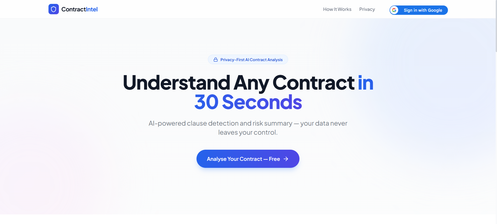
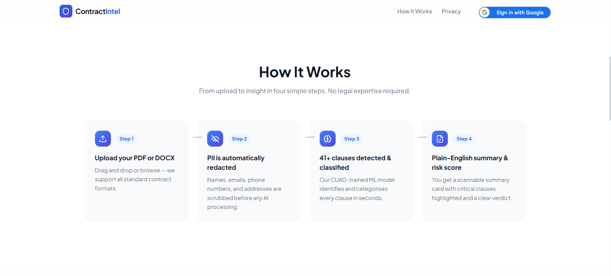
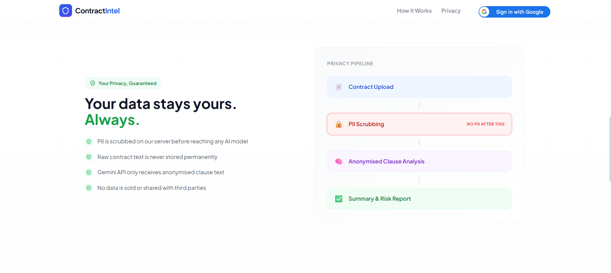
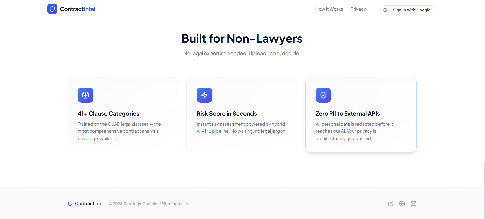
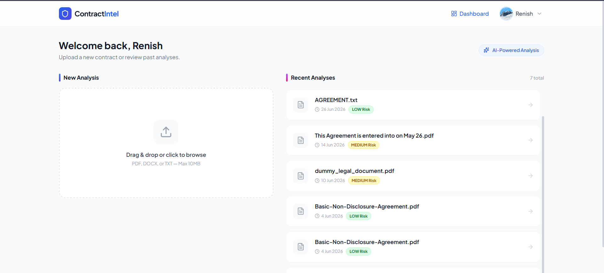
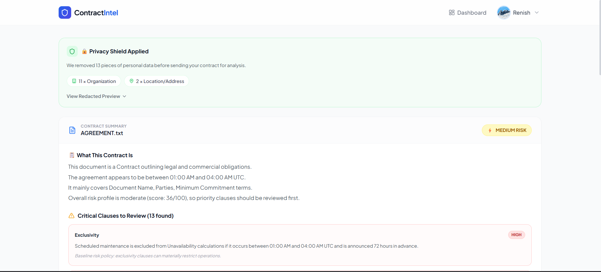
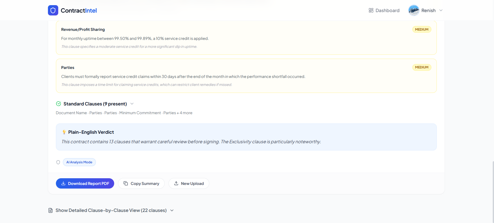
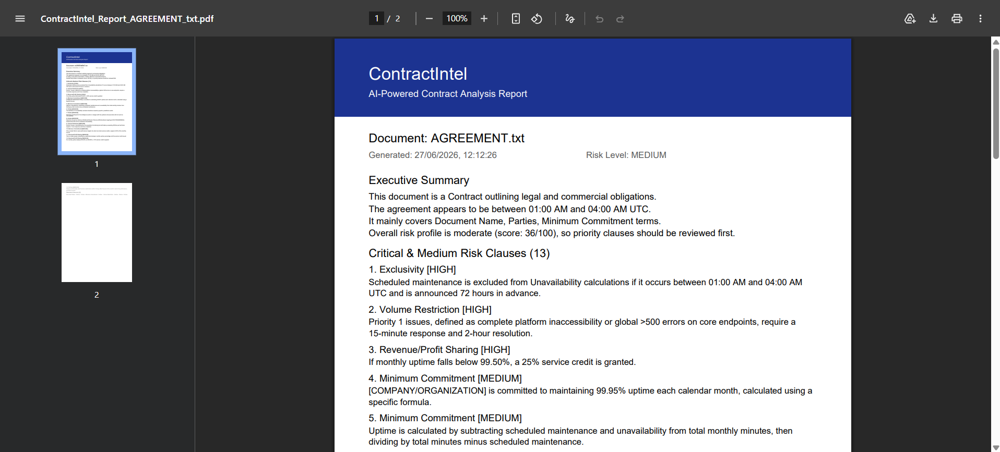

<div align="center">

<br/>

# ContractIntel

### Privacy-First AI Contract Analysis Platform

<p align="center">
  <a href="https://contract-intel-omega.vercel.app">
    
  </a>
</p>

<p align="center">
  
  
  
  
  
  
  
  
</p>

<br/>

> Upload any legal contract. ContractIntel scrubs your personal data, classifies 41+ clause types using a CUAD-trained ML model, and delivers a plain-English risk summary — **all before a single character of your PII ever reaches an AI model.**

<br/>

[**→ Try It Free**](https://contract-intel-omega.vercel.app) &nbsp;&nbsp;|&nbsp;&nbsp; [**→ View Demo**](#screenshots) &nbsp;&nbsp;

</div>

---

## What It Does

ContractIntel transforms dense, complex legal agreements into structured, human-readable insights in under 30 seconds — no legal expertise required.

| | Feature | Detail |
|---|---|---|
| 🔒 | **PII Scrubbing** | Two-pass pipeline (Regex + spaCy NER) removes all personal data *before* any AI processing |
| 🧠 | **41+ Clause Categories** | CUAD-trained TF-IDF + LinearSVC model classifies every clause locally, on-server |
| ⚡ | **Instant Risk Score** | HIGH / MEDIUM / LOW score calculated from clause types — no waiting, no legal jargon |
| 📋 | **Summary Card** | Critical clauses always visible; plain-English verdict tells you the #1 thing to know |
| 🛡️ | **Redaction Disclosure** | Shows exactly how many pieces of PII were removed and what category each belonged to |
| 📥 | **PDF Report** | Downloadable 2-page report with full clause breakdown, generated client-side |
| 👤 | **Google OAuth** | Secure login with session history — all past analyses saved to your dashboard |
| 📁 | **Analysis History** | Dashboard lists every past contract with risk badge and one-click access |

---

## Screenshots

### Landing Page — Hero


<br/>

### How It Works — 4-Step Flow


<br/>

### Privacy Pipeline — Your Data Stays Yours


<br/>

### Feature Highlights


<br/>

### Dashboard — Upload & Analysis History


<br/>

### Analysis Result — Summary Card



<br/>

### Downloadable PDF Report


---

## Privacy Architecture

ContractIntel is built **privacy-by-design** — raw personal data never reaches any external AI model. The two-pass scrubbing pipeline runs first, before anything else.

```
┌─────────────────────────────────────────────────────────────────┐
│                        USER UPLOADS CONTRACT                    │
└──────────────────────────────┬──────────────────────────────────┘
                               │
                               ▼
              ┌────────────────────────────────┐
              │   PASS 1 — Regex Pattern Match  │
              │                                │
              │  • Email addresses             │
              │  • Phone numbers               │
              │  • Dates of birth              │
              │  • IP addresses                │
              │  • Social security numbers     │
              └───────────────┬────────────────┘
                              │
                              ▼
              ┌────────────────────────────────┐
              │   PASS 2 — spaCy NER           │
              │   (en_core_web_sm)             │
              │                                │
              │  • PERSON entities             │
              │  • ORG entities                │
              │  • GPE / LOC entities          │
              └───────────────┬────────────────┘
                              │
                              ▼  ◄── NO PII EXISTS AFTER THIS POINT
              ┌────────────────────────────────┐
              │   Clause Classification        │
              │   TF-IDF + LinearSVC (local)   │
              │   41+ CUAD categories          │
              │   Runs entirely on our server  │
              └───────────────┬────────────────┘
                              │
                              ▼
              ┌────────────────────────────────┐
              │   Gemini 2.5 Flash Lite        │
              │   Receives ONLY anonymised     │
              │   clause text — zero PII       │
              └───────────────┬────────────────┘
                              │
                              ▼
              ┌────────────────────────────────┐
              │   Summary Card + Risk Score    │
              │   + Redaction Disclosure Panel │
              │   + Downloadable PDF Report    │
              └────────────────────────────────┘
```

**Privacy guarantees:**
- ✅ PII scrubbed on our server before any AI model sees the text
- ✅ Raw contract text is never stored permanently
- ✅ Gemini API only receives anonymised clause text
- ✅ No data is sold or shared with third parties
- ✅ Users see exactly what was redacted, broken down by category

---

## Tech Stack

### Frontend
| Technology | Purpose |
|---|---|
| React 18 + Vite | UI framework and build tool |
| TailwindCSS | Utility-first styling |
| `@react-oauth/google` | Google OAuth login flow |
| `react-dropzone` | Drag-and-drop file upload |
| `jsPDF` | Client-side PDF report generation |
| `framer-motion` | Landing page animations |

### Backend
| Technology | Purpose |
|---|---|
| Django 5 + Django REST Framework | API server |
| `django-allauth` | Google OAuth token exchange |
| `pdfplumber` | PDF text extraction |
| `python-docx` | DOCX text extraction |
| `spaCy` (`en_core_web_sm`) | Named entity recognition for PII removal |
| `scikit-learn` | TF-IDF vectorizer + LinearSVC classifier |
| `google-generativeai` | Gemini 2.5 Flash Lite integration |
| PostgreSQL | Production database |

### Infrastructure
| Service | Purpose |
|---|---|
| Vercel | Frontend hosting, auto-deploy on push |
| Render | Backend hosting (Python/Django) |

---

## ML Pipeline

### Clause Classification
The clause classifier is trained on the **CUAD (Contract Understanding Atticus Dataset)** — a benchmark dataset of 510 commercial legal contracts with 41 expert-labelled clause categories.

```
Raw Contract Text (PII-scrubbed)
         │
         ▼
TfidfVectorizer
  - ngram_range=(1, 2)
  - max_features=50,000
  - sublinear_tf=True
  - analyzer='word'
         │
         ▼
LinearSVC (per-category binary classifiers)
  - C=1.0
  - class_weight='balanced'
  - max_iter=2000
         │
         ▼
41+ Clause Category Labels + Confidence Scores
```

**Why LinearSVC over transformers?**  
Render's free tier has a 512MB RAM limit. LinearSVC on TF-IDF features uses ~40MB at inference vs 500MB+ for even the smallest BERT model. It also generalises well to unseen contracts because TF-IDF captures legal n-gram patterns that are consistent across contract types.

### Risk Scoring Logic
```python
HIGH_RISK_CLAUSE_TYPES = [
    "Limitation of Liability", "IP Assignment", "Non-Compete",
    "Automatic Renewal", "Unilateral Amendment", "Indemnification"
]

def calculate_risk_score(flagged_clauses):
    high_count = sum(
        1 for c in flagged_clauses
        if c["type"] in HIGH_RISK_CLAUSE_TYPES
    )
    if high_count >= 3: return "HIGH"
    if high_count >= 1: return "MEDIUM"
    return "LOW"
```

### AI Summary (Gemini Integration)
Gemini 2.5 Flash Lite is prompted to return **structured JSON only** — contract type, what it is in plain English, critical clauses with explanations, and a plain-English verdict. A deterministic local fallback runs if Gemini times out (Render's 30-second limit).

---

## Project Structure

```
Contract_Intel/
├── backend/
│   ├── contractintel/
│   │   ├── settings.py         # Django config, CORS, OAuth
│   │   └── urls.py
│   ├── analysis/
│   │   ├── models.py           # Contract, AnalysisResult, UserProfile
│   │   ├── views.py            # Upload, analyse, history, health
│   │   ├── serializers.py
│   │   ├── pii_scrubber.py     # Two-pass PII removal (regex + spaCy)
│   │   ├── clause_classifier.py # TF-IDF + LinearSVC inference
│   │   └── gemini_client.py    # Gemini integration + local fallback
│   ├── requirements.txt
│   └── manage.py
├── frontend/
│   ├── src/
│   │   ├── pages/
│   │   │   ├── Landing.jsx     # Public landing page
│   │   │   └── Dashboard.jsx   # Authenticated dashboard + history
│   │   ├── components/
│   │   │   ├── Header.jsx      # Auth-aware header
│   │   │   ├── SummaryCard.jsx # Analysis result card
│   │   │   ├── RedactionPanel.jsx  # PII disclosure panel
│   │   │   └── UploadPanel.jsx # Drag-and-drop upload
│   │   ├── context/
│   │   │   └── AuthContext.jsx # Google OAuth state management
│   │   ├── hooks/
│   │   │   ├── useAnalysis.js
│   │   │   └── useHistory.js
│   │   └── App.jsx
│   ├── .env.example
│   └── vite.config.js
├── docs/
│   └── screenshots/            # README screenshots
├── render.yaml                 # Render deployment config
├── GEMINI.md                   # Gemini CLI project skill file
└── README.md
```

---

## API Reference

| Method | Endpoint | Auth | Description |
|---|---|---|---|
| `POST` | `/api/analyse/` | ✅ Bearer token | Upload + analyse document |
| `GET` | `/api/history/` | ✅ Bearer token | List all past analyses for user |
| `GET` | `/api/result/<id>/` | ✅ Bearer token | Get single analysis result |
| `GET` | `/api/health/` | ❌ Public | Keep-alive health check |
| `POST` | `/auth/google/` | ❌ Public | Google OAuth token exchange |

**POST `/api/analyse/` — Response:**
```json
{
  "id": "3f2e1a-...",
  "filename": "service_agreement.pdf",
  "risk_score": "HIGH",
  "redaction_summary": {
    "total_removed": 13,
    "by_type": {
      "ORG": 11,
      "LOC": 2
    }
  },
  "summary": {
    "contract_type": "Service Level Agreement",
    "what_this_is": "A service agreement defining uptime commitments and remedies between a cloud provider and its client.",
    "critical_clauses": [
      {
        "name": "Limitation of Liability",
        "why_critical": "Caps the provider's total liability at one month's fees — well below typical industry standard.",
        "extracted_text": "Provider's liability shall not exceed fees paid in the prior 30-day period."
      }
    ],
    "standard_clause_names": ["Governing Law", "Force Majeure", "Notices"],
    "verdict": "This is a provider-friendly SLA. The liability cap is unusually low. Recommend legal review of indemnification terms before signing."
  },
  "created_at": "2026-06-27T12:12:26Z"
}
```

---

## Key Engineering Decisions

### Why two-pass PII scrubbing instead of just spaCy?
spaCy NER misses structured PII like emails and phone numbers — it's trained for natural language entities, not regex patterns. Regex alone misses context-dependent names. The two-pass approach catches both: regex handles structured patterns reliably, spaCy handles context-aware entities.

### Why TF-IDF + LinearSVC instead of a fine-tuned transformer?
Render free tier: 512MB RAM. Even the smallest BERT model requires ~500MB at inference, leaving zero headroom. TF-IDF + LinearSVC uses ~40MB and still achieves strong performance on CUAD because legal clause language is highly consistent and n-gram features capture it well.

### Why a local fallback for Gemini?
Render's 30-second timeout is hard. On cold starts (after 15 minutes of inactivity), the full pipeline + Gemini round-trip can exceed this. The local fallback generates a deterministic summary from the classifier output so users always see a result — never a timeout error page.

### Why `@react-oauth/google` instead of the legacy GSI script?
The Google Sign-In (GSI) JavaScript library is deprecated and has known issues with Chrome's FedCM changes and mobile incognito mode. `@react-oauth/google` is React 18-compatible, actively maintained, and handles the popup/redirect flow cleanly without manual script injection.

---

## Roadmap

- [ ] Redline comparison — diff two contract versions and highlight changes
- [ ] Clause negotiation suggestions — "here's a fairer alternative to this clause"
- [ ] Batch upload — analyse multiple contracts in one session
- [ ] Multi-language support — contracts in Hindi, French, German
- [ ] Team workspaces — shared contract history across an organisation

---

## Author

<div align="center">

### Renish Nagapara

**B.Tech Computer Engineering (AI/ML) — GCET Anand, Gujarat**

<p>
  <a href="https://in.linkedin.com/in/renish-nagapara-597814329">
    
  </a>
  &nbsp;
  <a href="https://github.com/renish7606">
    
  </a>
  &nbsp;
  <a href="mailto:renishpatel7606@gmail.com">
    
  </a>
</p>

*Open to AI/ML and Software Engineering roles.*

</div>

---

<div align="center">

© 2026 ContractIntel &nbsp;·&nbsp; Zero logs &nbsp;·&nbsp; Complete PII compliance

**[→ Try ContractIntel Free](https://contract-intel-omega.vercel.app)**

</div>
